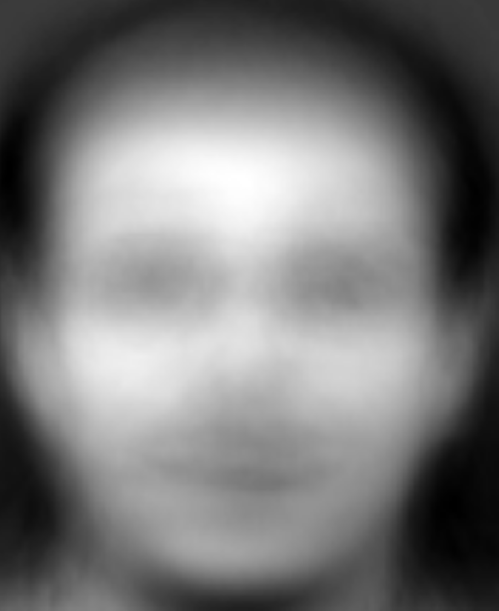

# Eigenfaces
Experimental facial recognition app  

## Abstract
Using applied linear algebra and principal component analysis (PCA), we can approximate an image of someone's face as a matrix and define this matrix in terms of the principal components. Using PCA, we can approximate
an image with far less data than an image, while still being able to recreate the image. In this implementation, we gathered a dataset of human faces. Then we found the eigenvectors of the covariance matrix of the dataset. 
These eigenvectors can be used to recreate every face in the database, and mostly recreate all other human faces as well. These eigenvectors are images themselves, of a principal component of the faces in the dataset. We call
them Eigenfaces. We can represent each face as a linear combination of these eigenfaces. By comparing the strength of each Eigenface in real human faces, we can find which faces are similar and are likely of the same person.
I implemented an Android Application to allow users to submit faces of their choosing, and for a new face, find the closest match of the faces already submitted.

## Mathematical Explanation
First, I'll explain the mathematical basis for this app and method.  
Even low-resolution images, for example the 112x92 grayscale images I used for this project, have an immense amount of data. The images in this project have over 10k pixels, which makes any kind of analysis on them very difficult and computationally expensive, not to mention the bad experience for the user. To make analysis of such objects easier, we can use principal component analysis (PCA) to find the components of greatest variation in our dataset, then representeach data point as a linear combination of these components at different magnitudes.  
One way of finding these principal components is compact Singular Value Decompostion (SVD), a process by which a matrix is decomposed into a semi-unitary matrix (U), a diagonal matrix of square roots of non-zero eigenvalues (S), and another semi-unitary matrix (VT). The detailed mathematical specifics of this process are not important, but the end result is that the transpose of the second semi-unitary matrix (V) is a collection of eigenvalues, our principal components. Compact SVD provides a useful alternative to finding the covariance matrix, a matrix that would be even larger than the one required for compact SVD. For compact SVD, we flatten each 112x92 image into a column vector of values 0..255, which represent the grayscale brightness. Then, we build a dataset matrix where there is a column for each image in our dataset, 400 columns for my dataset. Before we analyze this dataset matrix using SVD, we must center the variation at 0. We do this by finding the average face (see below) and subtracting it from each face in our dataset. This way, the SVD only analyzes variance from the "center". Now, the matrix is ready to be analyzed using a compact SVD program so that we can get the eigenvectors that represent the Eigenfaces. These Eigenfaces are our principal components, and the represent certain facial characteristics that make up a total face, for example dark or light eyes, or a full head of hair vs a bald head.  
  
With the Eigenfaces calculated, we can simply multiply a face we want to analyze by the eigenvectors, as the V matrix is essentially a coordinate transformation matrix (face_flattened @ V). face_flattened is 1x10304 (there are 10304 total pixels in my image) and V is 10304x400, so the end result is a column vector of 400 values of the strength of each Eigenface to represent the original image. 400 values is far less than the 10304 needed to represent the image with just pixels. These values are the magnitude of each component in the face analyzed, but we can think of them as coordinates. If we analyze the "distance" between each face using these coordinates, we can find the closest face in the Eigenface space and thus which face is the closest match.

## Implementation Through an Android Application

## Development Journey

### Credits
Original method written by Professor Jer-Chin Chuang and the MATH257 Staff at the University of Illinois Urbana Champaign  
MyImageView class based on custom class created by [Hank on StackOverflow](https://stackoverflow.com/questions/12169905/zoom-and-panning-imageview-android)  
Model was trained on data from the AT&T Cambridge Laboratory
